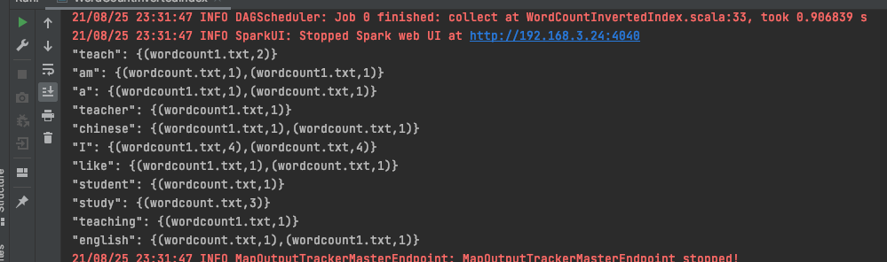
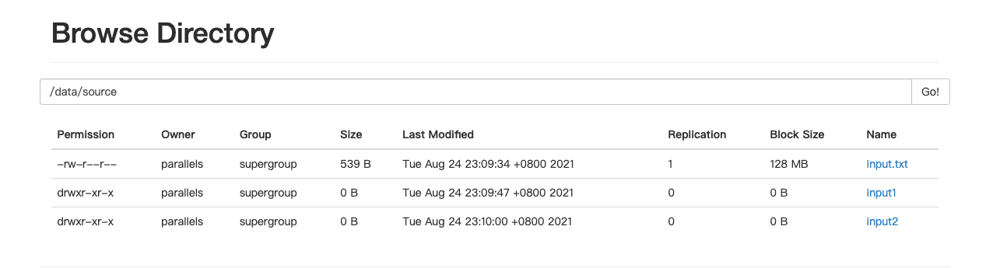
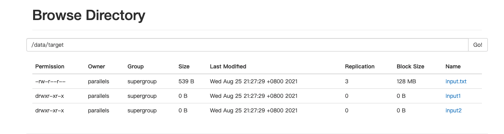

## 第五次作业

### 作业一、使用RDD API实现带词频的倒排索引
>倒排索引(Inverted index)，也被称为反向索引。它是文档检索系统中最常用的数据结构。被广泛 地应用于全文搜索引擎。  
例子如下，被索引的文件为(0，1，2代表文件名)
```
0. "it is what it is"
1. "what is it"
2. "it is a banana" 我们就能得到下面的反向文件索引: "a": {2}
"banana": {2}
"is": {0, 1, 2}
"it": {0, 1, 2}
"what": {0, 1} 再加上词频为:
"a": {(2,1)}
"banana": {(2,1)}
"is": {(0,2), (1,1), (2,1)} "it": {(0,2), (1,1), (2,1)} "what": {(0,1), (1,1)}
```
[代码](https://github.com/kangapp/JikeJob/blob/main/HadoopTest/src/main/scala/spark/WordCountInvertedIndex.scala)

- 输入数据


- 运行结果  



### 作业二、Distcp的spark实现

[主代码](https://github.com/kangapp/JikeJob/blob/main/HadoopTest/src/main/scala/spark/SparkDistcpApp.scala)  
[hdfs工具类](https://github.com/kangapp/JikeJob/blob/main/HadoopTest/src/main/java/org/hadoop/HdfsUtil.java)

#### 输出截图
- source  


- target


