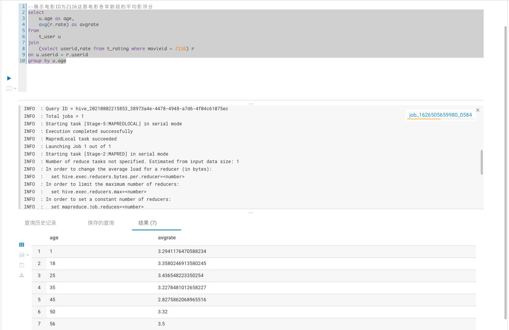
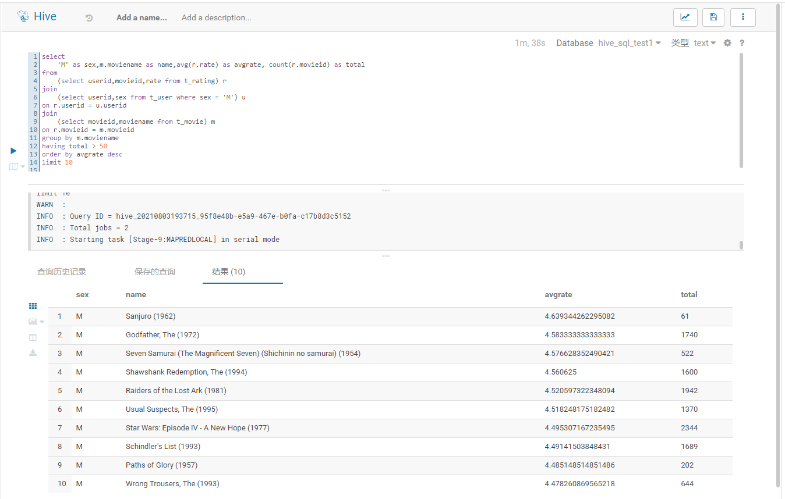
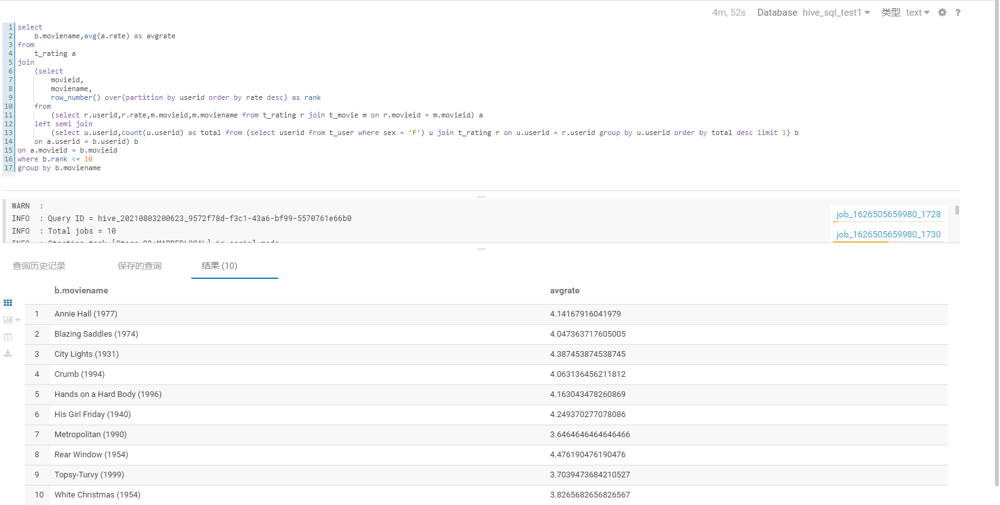
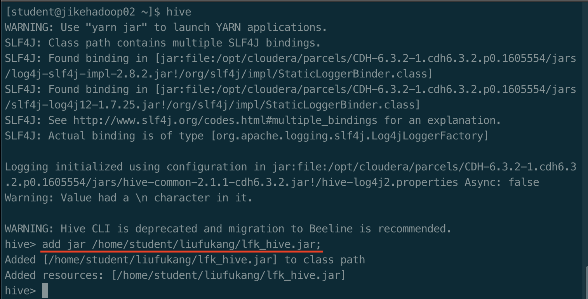
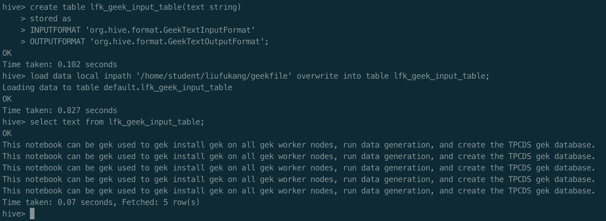
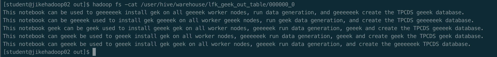

## 第四次作业

### hive sql
- 展示电影ID为2116这部电影各年龄段的平均影评分

- 找出男性评分最高且评分次数超过50次的10部电影，展示电影名，平均影评分和评分次数

- 找出影评次数最多的女士所给出最高分的10部电影的平均影评分，展示电影名和平均影评分（可使用多行SQL）


### 附加作业
> 要求：  
实现两个类：GeekTextInputFormat和GeekTextOutputFormat  
建表时使用create table ... stored as geek来创建GeekFormat表  
该表的文件类型为文本类型，非二进制类型  
类似Base64TextInputFormat和Base64TextOutputFormat，GeekFormat也是用于加密
解密规则如下：文件中出现任何的geek，geeeek，geeeeeeeeeeek等单词时，进行过滤，即删除该单词。gek需要保留。字母中连续的“e”最大长度为256个。  
例如：    This notebook can be geeeek used to geek install gek on all geeeek worker nodes, run data generation, and create the TPCDS geeeeeeeeek database.  
解密为：This notebook can be used to install gek on all worker nodes, run data generation, and create the TPCDS database.  
【附加的附加】加密规则如下：文件输出时每随机2到256个单词，就插入一个gee...k，字母e的个数等于前面出现的非gee...k单词的个数。  
例如：    This notebook can be used to install gek on all worker nodes, run data generation, and create the TPCDS database.
加密为：This notebook can be geeeek used to geek install gek on all geeeek worker nodes, run data generation, and create the TPCDS geeeeeeeeek database.


#### 代码实现
- [GeekTextInputFormat](https://github.com/kangapp/JikeJob/blob/main/HadoopTest/src/main/java/org/hive/format/GeekTextInputFormat.java)  
参考Base64TextInputFormat,实现next()方法
- [GeekTextOutputFormat](https://github.com/kangapp/JikeJob/blob/main/HadoopTest/src/main/java/org/hive/format/GeekTextOutputFormat.java)  
参考Base64TextOutputFormat,实现write()方法

#### 验证过程

- 代码编译并上传jar包
- 添加jar包到hive库中，使用add jar命令

- 准备测试数据geekfile
```txt
This notebook can be geeeek used to geek install gek on all geeeek worker nodes, run data ge
neration, and create the TPCDS geeeeeeeeek database.
This notebook can be geeeek used to geek install gek on all geeeek worker nodes, run data ge
neration, and create the TPCDS geeeeeeeeek database.
This notebook can be geeeek used to geek install gek on all geeeek worker nodes, run data ge
neration, and create the TPCDS geeeeeeeeek database.
This notebook can be geeeek used to geek install gek on all geeeek worker nodes, run data ge
neration, and create the TPCDS geeeeeeeeek database.
This notebook can be geeeek used to geek install gek on all geeeek worker nodes, run data ge
neration, and create the TPCDS geeeeeeeeek database.
```
- 创建表1并导入测试数据
```sql
create table lfk_geek_input_table(text string)
stored as 
INPUTFORMAT 'org.hive.format.GeekTextInputFormat'
OUTPUTFORMAT 'org.hive.format.GeekTextOutputFormat';

load data local inpath '/home/student/liufukang/geekfile' overwrite into table lfk_geek_input_table;

select text from lfk_geek_input_table;
```
从结果可以看出数据已经解密成功


- 创建表2并从表1导入数据
```sql
create table lfk_geek_out_table(text string)
stored as 
INPUTFORMAT 'org.hive.format.GeekTextInputFormat'
OUTPUTFORMAT 'org.hive.format.GeekTextOutputFormat';

insert overwrite table lfk_geek_out_table select text from lfk_geek_input_table;
```
查看表lfk_geek_out_table的hdfs文件，可以看到数据加密成功
