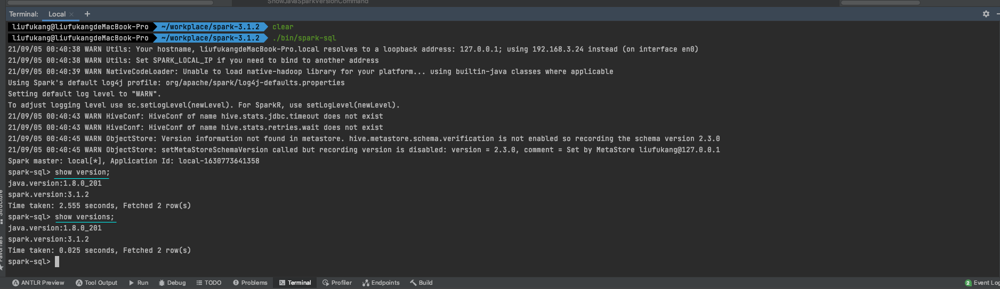
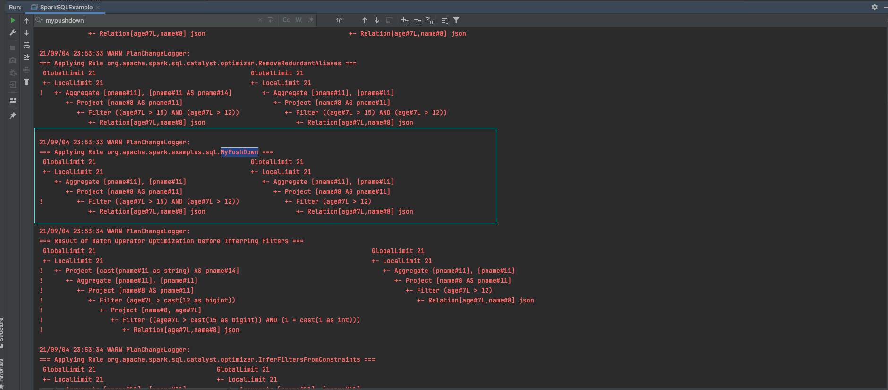
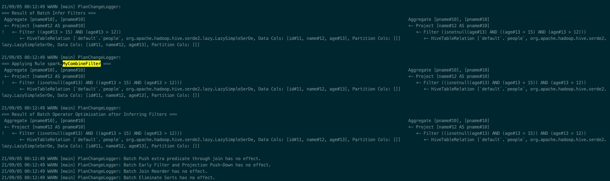

## 第六次作业

### 为Spark SQL添加一条自定义命令
> SHOW VERSION;  
显示当前Spark版本和Java版本

- 在SqlBase.g4文件添加关键词并用自带的antlr4工具进行编译
```text
statement
    | SHOW VERSION                     #showJavaSparkVersion

ansiNonReserved
    | VERSION

nonReserved
    | VERSION

VERSION: 'VERSION' | 'VERSIONS';
```
查看SqlBaseParser，新增了ShowJavaSparkVersionContext
```scala
public static class ShowJavaSparkVersionContext extends StatementContext {
    public TerminalNode SHOW() { return getToken(SqlBaseParser.SHOW, 0); }
    public TerminalNode VERSION() { return getToken(SqlBaseParser.VERSION, 0); }
    public ShowJavaSparkVersionContext(StatementContext ctx) { copyFrom(ctx); }
    @Override
    public void enterRule(ParseTreeListener listener) {
        if ( listener instanceof SqlBaseListener ) ((SqlBaseListener)listener).enterShowJavaSparkVersion(this);
    }
    @Override
    public void exitRule(ParseTreeListener listener) {
        if ( listener instanceof SqlBaseListener ) ((SqlBaseListener)listener).exitShowJavaSparkVersion(this);
    }
    @Override
    public <T> T accept(ParseTreeVisitor<? extends T> visitor) {
        if ( visitor instanceof SqlBaseVisitor ) return ((SqlBaseVisitor<? extends T>)visitor).visitShowJavaSparkVersion(this);
        else return visitor.visitChildren(this);
    }
}
```
查看SqlBaseBaseVisitor，新增了visitShowJavaSparkVersion方法
```scala
/**
* {@inheritDoc}
*
* <p>The default implementation returns the result of calling
* {@link #visitChildren} on {@code ctx}.</p>
*/
@Override public T visitShowJavaSparkVersion(SqlBaseParser.ShowJavaSparkVersionContext ctx) { return visitChildren(ctx); }
```

- 在SparkSqlParser中重写visitShowJavaSparkVersion并实现自定义command  
`SparkSqlParser`
```scala
override def visitShowJavaSparkVersion(
    ctx: ShowJavaSparkVersionContext): LogicalPlan = withOrigin(ctx) {
ShowJavaSparkVersionCommand()
}
```
`ShowJavaSparkVersionCommand`
```scala
case class ShowJavaSparkVersionCommand() extends RunnableCommand {

  override val output: Seq[Attribute] =
    Seq(AttributeReference("version", StringType, nullable = true)())

  override def run(sparkSession: SparkSession): Seq[Row] = {

    val java_version = System.getProperty("java.version");
    val spark_version = sparkSession.sparkContext.version
    val outputString_java = s"java.version:${java_version}"
    val outputString_spark = s"spark.version:${spark_version}"
    Seq(Row(outputString_java), Row(outputString_spark))
  }
}
```

- 运行结果



### 构建SQL满足如下要求

#### 构建一条SQL，同时apply下面三条优化规则
> CombineFilters  
CollapseProject  
BooleanSimplification

#### 构建一条SQL，同时apply下面五条优化规则
> ConstantFolding  
PushDownPredicates  
ReplaceDistinctWithAggregate  
ReplaceExceptWithAntiJoin  
FoldablePropagation

### 实现自定义优化规则（静默规则）
> 参考CombineFilters实现自定义的Filter合并规则  
合并同一个属性值存在多个大于等情况  
例如：age > 10 and age > 20  合并成    age > 10

#### 实现方式1:本地测试

- 核心代码
```scala
package org.apache.spark.examples.sql

import org.apache.spark.sql.SparkSession

import org.apache.spark.sql.catalyst.expressions._
import org.apache.spark.sql.catalyst.plans.logical.{Filter, LogicalPlan}
import org.apache.spark.sql.catalyst.rules.Rule

object SparkSQLExample {

  def main(args: Array[String]): Unit = {
    // $example on:init_session$
    val spark = SparkSession
      .builder()
      .appName("Spark SQL basic example")
      .config("spark.some.config.option", "some-value")
      .config("spark.sql.planChangeLog.level", "warn")
      .withExtensions(extensions => {
        extensions.injectOptimizerRule{
          session => {
            MyPushDown(session)
          }
        }
      })
      .getOrCreate()

    import spark.sql
    val df = spark.read.json("examples/src/main/resources/people.json")
    df.createOrReplaceTempView("people")

    sql("select distinct name as pname " +
      "from (select name, age from people " +
      "where age>15 and 1='1') t " +
      "where t.age>12" ).show()

    spark.stop()
  }
}

case class MyPushDown(session: SparkSession) extends Rule[LogicalPlan] with PredicateHelper {
  def apply(plan: LogicalPlan): LogicalPlan = plan transformDown {
    case Filter(fc, child) =>
      val expressions = ExpressionSet(splitConjunctivePredicates(fc))
      val greaterThan = expressions.filter(_.isInstanceOf[GreaterThan])
        .groupBy(_.asInstanceOf[GreaterThan].left.asInstanceOf[Attribute].name).toArray
        .map{
        item =>
          item._2.minBy(_.asInstanceOf[GreaterThan].
            right.asInstanceOf[Literal].value.toString).asInstanceOf[GreaterThan]
      }
      val result_expressions = expressions.filter{
        case expression: GreaterThan => false
        case _ => true
      } ++ greaterThan
      result_expressions.reduceOption(And) match {
        case Some(ac) =>
          Filter(ac, child)
        case None =>
          Filter(fc, child)
      }
  }
}

```

- 运行日志  



#### 实现方式2:打包到emr环境测试

[MyCombineFilter](https://github.com/kangapp/JikeJob/blob/main/HadoopTest/src/main/scala/spark/MyCombineFilter.scala)  
[MyCombineFilter](https://github.com/kangapp/JikeJob/blob/main/HadoopTest/src/main/scala/spark/MySparkSessionExtension.scala)

- 启动spark sql
```sh
spark-sql --jars /home/student04/student/liufukang/my.jar --conf spark.sql.extensions=spark.MySparkSessionExtension
```
- 设置planChangeLog.level
```sh
spark-sql> set spark.sql.planChangeLog.level=WARN;
```

- sql查询
```sql
spark-sql> select distinct name as pname from (select name, age from people where age>15 and 1='1') t where t.age>12;
```

- 日志查看
> 虽然应用到了自定义的优化规则，但是并没有实现本地测试的预期结果

