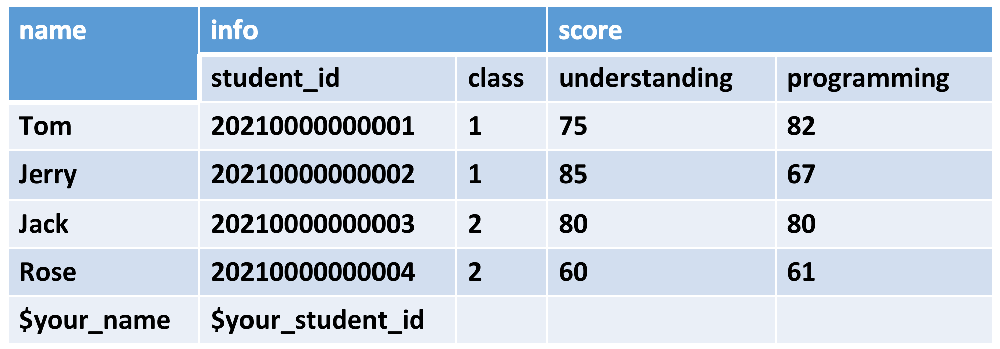

## 第三次作业
### 作业要求
编程实践，使用 Java API 操作 HBase  
主要实践建表、插入数据、删除数据、查询等功能。要求建立一个如下所示的表：

### 作业结果

[hbase主类](https://github.com/kangapp/JikeJob/blob/main/HadoopTest/src/main/java/org/hbase/job/HBaseApp.java)

[hbase工具类](https://github.com/kangapp/JikeJob/blob/main/HadoopTest/src/main/java/org/hbase/util/HBaseUtil.java)

