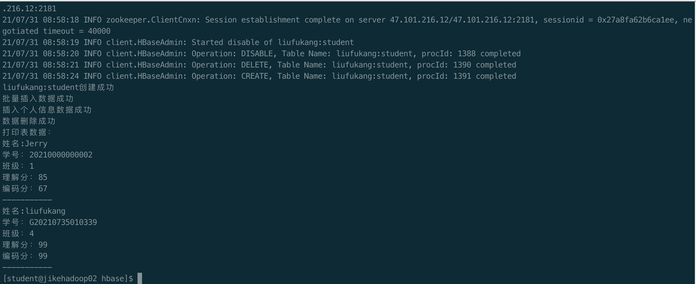

## 第三次作业
### 作业要求
编程实践，使用 Java API 操作 HBase  
主要实践建表、插入数据、删除数据、查询等功能。要求建立一个如下所示的表：


### 执行脚本
```bash
java -cp ".:/opt/cloudera/parcels/CDH-6.3.2-1.cdh6.3.2.p0.1605554/lib/hbase/bin/../conf:/usr/lib/jvm/java-openjdk/lib/tools.jar:/opt/cloudera/parcels/CDH-6.3.2-1.cdh6.3.2.p0.1605554/lib/hbase/bin/..:/opt/cloudera/parcels/CDH-6.3.2-1.cdh6.3.2.p0.1605554/lib/hbase/bin/../lib/shaded-clients/hbase-shaded-client-byo-hadoop-2.1.0-cdh6.3.2.jar:/opt/cloudera/parcels/CDH-6.3.2-1.cdh6.3.2.p0.1605554/lib/hbase/bin/../lib/client-facing-thirdparty/audience-annotations-0.5.0.jar:/opt/cloudera/parcels/CDH-6.3.2-1.cdh6.3.2.p0.1605554/lib/hbase/bin/../lib/client-facing-thirdparty/commons-logging-1.2.jar:/opt/cloudera/parcels/CDH-6.3.2-1.cdh6.3.2.p0.1605554/lib/hbase/bin/../lib/client-facing-thirdparty/findbugs-annotations-1.3.9-1.jar:/opt/cloudera/parcels/CDH-6.3.2-1.cdh6.3.2.p0.1605554/lib/hbase/bin/../lib/client-facing-thirdparty/htrace-core4-4.2.0-incubating.jar:/opt/cloudera/parcels/CDH-6.3.2-1.cdh6.3.2.p0.1605554/lib/hbase/bin/../lib/client-facing-thirdparty/log4j-1.2.17.jar:/opt/cloudera/parcels/CDH-6.3.2-1.cdh6.3.2.p0.1605554/lib/hbase/bin/../lib/client-facing-thirdparty/slf4j-api-1.7.25.jar:/etc/hadoop/conf:/opt/cloudera/parcels/CDH-6.3.2-1.cdh6.3.2.p0.1605554/lib/hadoop/libexec/../../hadoop/lib/*:/opt/cloudera/parcels/CDH-6.3.2-1.cdh6.3.2.p0.1605554/lib/hadoop/libexec/../../hadoop/.//*:/opt/cloudera/parcels/CDH-6.3.2-1.cdh6.3.2.p0.1605554/lib/hadoop/libexec/../../hadoop-hdfs/./:/opt/cloudera/parcels/CDH-6.3.2-1.cdh6.3.2.p0.1605554/lib/hadoop/libexec/../../hadoop-hdfs/lib/*:/opt/cloudera/parcels/CDH-6.3.2-1.cdh6.3.2.p0.1605554/lib/hadoop/libexec/../../hadoop-hdfs/.//*:/opt/cloudera/parcels/CDH/lib/hadoop-mapreduce/.//*:/opt/cloudera/parcels/CDH-6.3.2-1.cdh6.3.2.p0.1605554/lib/hadoop/libexec/../../hadoop-yarn/lib/*:/opt/cloudera/parcels/CDH-6.3.2-1.cdh6.3.2.p0.1605554/lib/hadoop/libexec/../../hadoop-yarn/.//*:/etc/hadoop/conf/opt/cloudera/parcels/CDH-6.3.2-1.cdh6.3.2.p0.1605554/bin/../lib/hadoop/*:/opt/cloudera/parcels/CDH-6.3.2-1.cdh6.3.2.p0.1605554/bin/../lib/hadoop/lib/*:/opt/cloudera/parcels/CDH-6.3.2-1.cdh6.3.2.p0.1605554/bin/../lib/zookeeper/*:/opt/cloudera/parcels/CDH-6.3.2-1.cdh6.3.2.p0.1605554/bin/../lib/zookeeper/lib/*:/home/student/liufukang/hbase/*" org.hbase.job.HBaseApp
```

### 执行结果


### 核心代码
[hbase主类](https://github.com/kangapp/JikeJob/blob/main/HadoopTest/src/main/java/org/hbase/job/HBaseApp.java)

[hbase工具类](https://github.com/kangapp/JikeJob/blob/main/HadoopTest/src/main/java/org/hbase/util/HBaseUtil.java)

